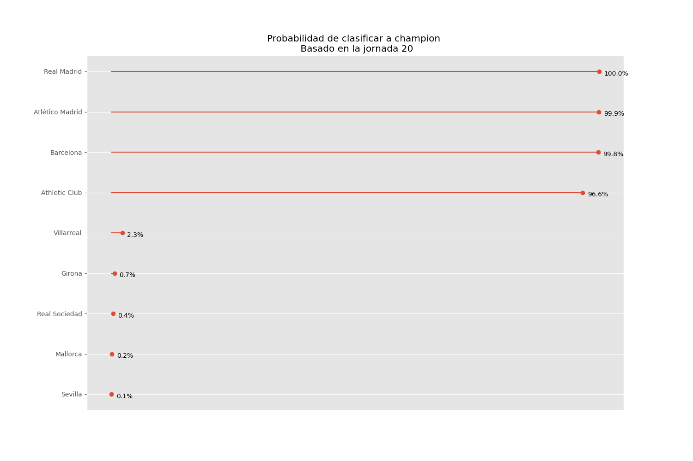
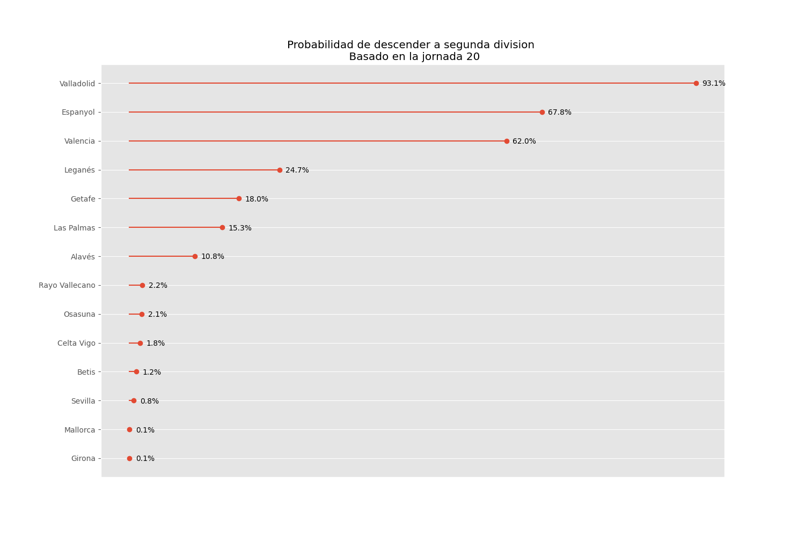

# :soccer: Prediccion Liga Española

Este proyecto tiene como objetivo predecir los campeones, clasificados a Champion League, clasificados a Europa League y descendidos en la liga Española.
El proyecto se compone de 4 partes principales:
- [Obtencion de la información](#book-obtencion-de-información)
- [Entreamiento del modelo](#bicyclist-entrenamiento-de-modelo)
- [Simulación](#dart-simulación)
- [Visualización](#bar_chart-visualización)

# :book: Obtencion de información

Fue necesario obtener informacion de los partidos y del estado de los clubes para entrenar el modelo. En este caso, se utilizó la pagina [fbref](https://fbref.com/es/) para obtener los resultados de los partidos de la temporada 2023-2024 de las 5 principales ligas de Europa. Ademas se uso el sistema de [ClubELo](http://clubelo.com/) para intentar cuantificar el estado del club antes de cada partido. A,bos conjuntos de datos fueron obtenidos por medio de WebScrapping y almacenados en un formato csv.

# :bicyclist: Entrenamiento de modelo

En esta fase se entrenaron cinco modelos de clasificación:
* lgb
* K neighbors classifier
* Gradient Boosting classifier
* Regresion logistica
* Random forest classifier
Además, se realizó un ajuste de hiperparámetros utilizando la biblioteca Optuna y se guardo el modelo con el mejor accuracy. En este caso fue la regresion logistica con un accuracy de 53.6%

# :dart: Simulación

La simulación consto de xxx pasos
1. Creacion de funciones para calcular el Elo de loss equipos de acuerdo al sistema de [ClubElo](http://clubelo.com/System)
2. Se obtuvo la información del estado actual de la liga Española (Partidos faltantes, tabla de la liga y Elo de los clubes de la liga)
3. Ejecucion del metodo Monte Carlo iterando por cada partido, actualizando los puntos y el puntaje elo por equipo en cada partido
4. Paralelización de la simulacion para lograr realizar un numero elevado de repeticiones sin tener una demora significativa.
5. Se guardo un historico por jornada de las probabilidades de los equipos de ser campeones, clasificar a Champion League, clasificar a Europa League o descender. 

# :bar_chart: Visualización

Se realizaron las siguientes visualizaciones:

## Campeones

## Clasificados a Champions League

## Clasificados a Europa League

## Descensos

